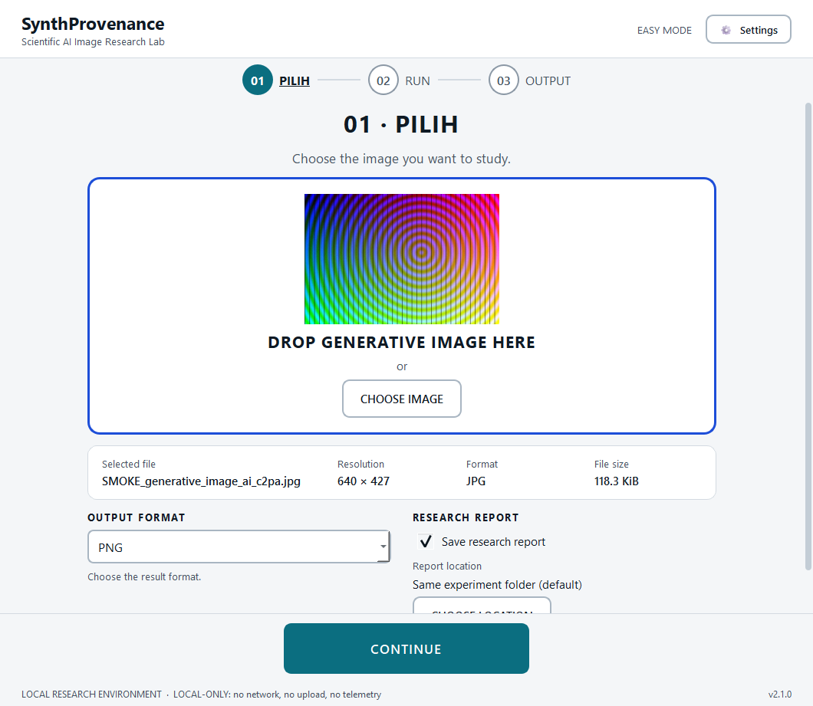
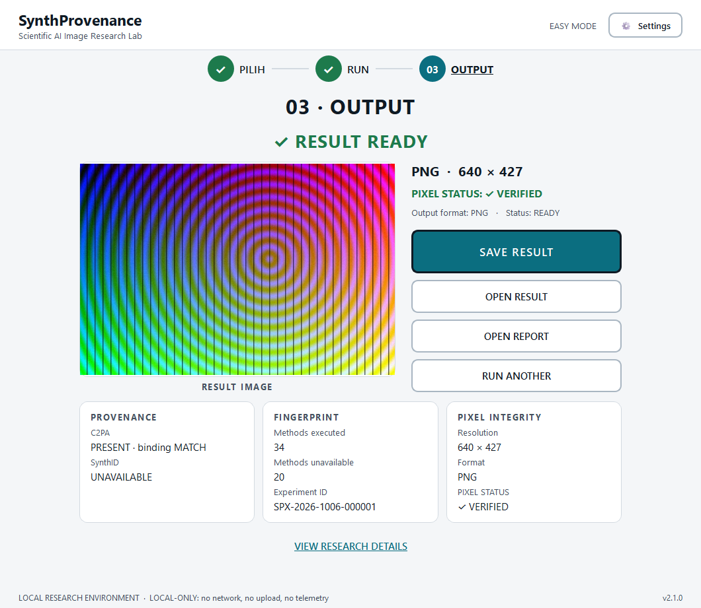
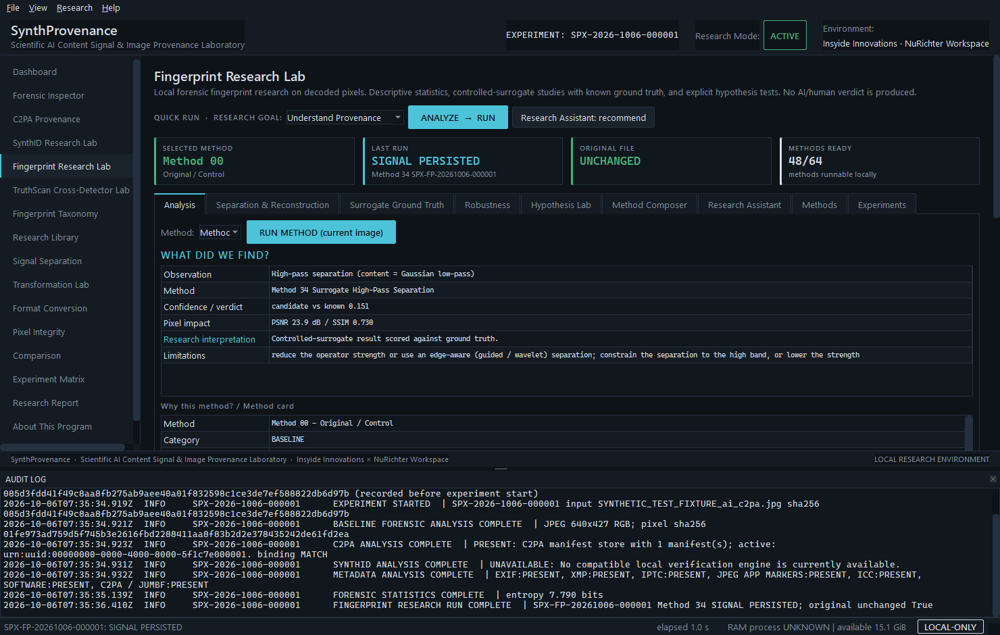
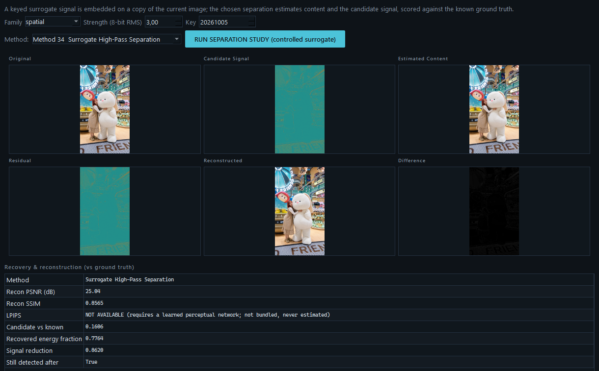
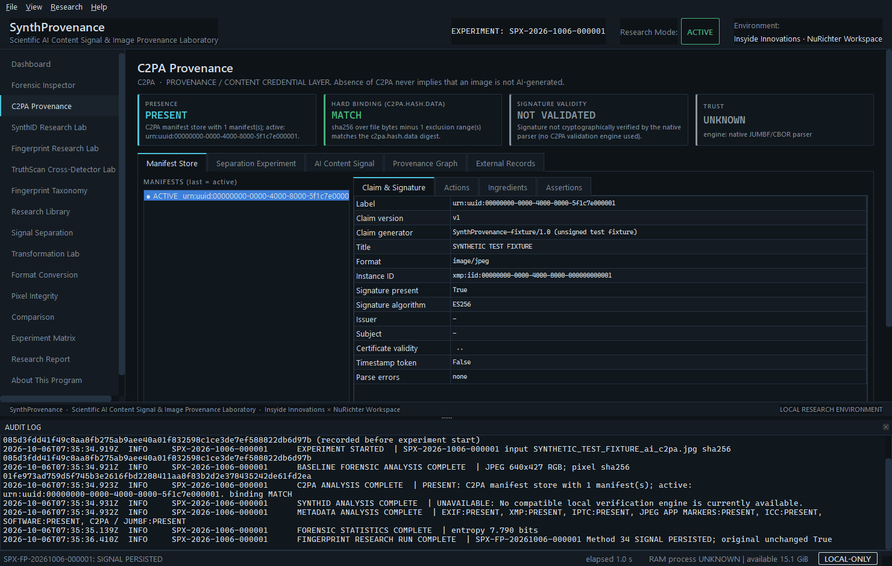

<picture>
  <source media="(prefers-color-scheme: dark)" srcset="docs/readme/hero-dark.svg">
  
</picture>

<p align="center"><sub>
Faculty of Computer Science &nbsp;·&nbsp; Insyide Innovations Lab &nbsp;·&nbsp; NuRichter Workspace<br>
PRIVATE SCIENTIFIC RESEARCH SOFTWARE &nbsp;·&nbsp; LOCAL RESEARCH ENVIRONMENT &nbsp;·&nbsp; v2.1.0 &nbsp;·&nbsp; Windows 10 / 11 x64
</sub></p>

<br>

An image is not one object. It is a stack of claims about where it came from. Some are written in the file, some
in its metadata, some in the pixel values themselves, and each layer survives a different amount of handling.
Metadata can vanish in a single re-save. A C2PA hard binding breaks when one byte changes. A pixel-domain signal
is built to survive some transformations and not others.

**SynthProvenance takes the image apart and measures every layer on its own terms, on a copy, with the original
hashed before and after.** Every condition, parameter, hash and metric is written down, so that someone who does
not trust you can repeat the experiment and check every number.

What it will not do is guess. Read the last line of the figure above: the lab measured everything it could about
that file, and the verdict field says *none issued*. That is not a missing feature. That is the product.

<p align="center">
<a href="#01--anatomy-of-a-specimen">Anatomy</a> &nbsp;·&nbsp;
<a href="#02--sixty-four-methods-one-88-block">64 methods</a> &nbsp;·&nbsp;
<a href="#03--two-doors-into-the-same-lab">Easy &amp; Expert</a> &nbsp;·&nbsp;
<a href="#04--run-it">Run it</a> &nbsp;·&nbsp;
<a href="#05--evidence-not-adjectives">Evidence</a> &nbsp;·&nbsp;
<a href="#06--sentences-this-lab-will-never-write">Refusals</a> &nbsp;·&nbsp;
<a href="#07--field-manual">Field manual</a> &nbsp;·&nbsp;
<a href="#08--known-limits">Limits</a>
</p>

<br>

## 01 · Anatomy of a specimen

<picture>
  <source media="(prefers-color-scheme: dark)" srcset="docs/readme/anatomy-dark.svg">
  
</picture>

Seven layers, seven instruments, seven separate readings. They are never averaged into one number.

| Layer | Lives | How the lab reads it |
|---|---|---|
| **External platforms** | outside the file | Labels shown by third parties, recorded by you. The app never contacts a platform. |
| **C2PA** | container | Native JUMBF / CBOR parse and hard-binding digest recomputation. Signature and trust come from `c2patool` or `c2pa-python` when installed, otherwise `NOT VALIDATED` and `UNKNOWN`. |
| **Ordinary metadata** | container | EXIF, XMP, IPTC, ICC, PNG text and TIFF tags, parsed and diffed field by field. |
| **File structure** | container | A byte-level walk of segments and chunks. |
| **Encoding** | codec | Container and codec parameters. |
| **Pixels** | decoded array | Sample-exact comparison: MAE, MSE, PSNR, SSIM, histogram, dHash. |
| **Embedded signal** | pixel values | SynthID, through a compatible local engine or an official check you run yourself. Otherwise `UNAVAILABLE`, and never inferred from metadata. |

<br>

## 02 · Sixty-four methods, one 8×8 block

<picture>
  <source media="(prefers-color-scheme: dark)" srcset="docs/readme/registry-dark.svg">
  
</picture>

A JPEG stores an image as 8×8 blocks of 64 DCT coefficients, read in zig-zag order from the top-left corner. The
Fingerprint Research Lab registers exactly 64 methods, so Fig. 2 lays them out the same way. Method 00, the
untouched original that serves as the control, lands on the DC coefficient: the one that holds the block's
average. Each cell is shaded with the DCT basis function of its own coefficient, computed rather than drawn.

The colours are an honesty report, generated from `data/fingerprint_execution_matrix.json`:

- **48 READY.** These run locally, in numpy, with no network.
- **12 UNAVAILABLE.** These need a trained model that is not bundled: nine need a deep-learning runtime and its
  weights, three need a classifier fitted on labelled data. Each one is documented and switched off. Nothing is
  faked and nothing is downloaded.
- **4 NOT IMPLEMENTED.** Methods 43–46 are detector-evasion techniques: adversarial optimisation, black-box
  detector attack, evolutionary search and differentiable attack. Their cards explain what they are and why they
  will not be built.

The letters under each cell are capability flags that the registry enforces: **A**nalyze, **E**stimate,
**S**eparate, **R**econstruct, **V**alidate. A method that only detects can never claim to separate. `S` appears
only on studies of a keyed surrogate that the lab embedded itself, so recovery is always scored against a known
ground truth.

<br>

## 03 · Two doors into the same lab

Both shells drive the same engines. Choose one in **Settings › APPLICATION MODE › SAVE & RESTART**, or use
`--ui-mode easy|expert` for a single session.

<table>
<tr>
<td width="50%" valign="top"></td>
<td width="50%" valign="top"></td>
</tr>
<tr>
<td valign="top"><sub><b>EASY MODE</b>, the default. <b>01 PILIH</b>: drop an image and choose PNG, JPG, WEBP, TIFF or BMP. <b>02 RUN</b>: one button.</sub></td>
<td valign="top"><sub><b>03 OUTPUT</b>: the result image, its pixel status, and three cards (provenance, fingerprint, pixel integrity) next to the full report.</sub></td>
</tr>
</table>

Behind the single RUN button, `app/core/easy_mode_orchestrator.py` runs a fixed pipeline:

```text
01 safety check      04 C2PA               07 signal estimation        10 validation
02 baseline hash     05 SynthID (local)    08 controlled separation    11 output
03 metadata          06 fingerprinting     09 multi-method consensus   12 report
```

The result image is a pixel-preserving re-encoding of your original. Separation and reconstruction run only on a
keyed surrogate embedded in a local copy, where the ground truth is known. Their results are reported. They are
never applied to your image.



<sub><b>EXPERT MODE</b> is the full research console: 17 views, from Dashboard, Forensic Inspector and C2PA Provenance
through the SynthID, Fingerprint and Cross-Detector labs to Experiment Matrix and Research Report. A live audit log
is docked underneath, and 15 colour themes are available. A seven-step Research Wizard (Input › Baseline ›
Research Target › Method › Experiment › Validation › Report) guides a first study.</sub>

<br>

## 04 · Run it

**Windows, from the release archive**

1. Extract `SynthProvenance.zip` to a writable folder with a short path, for example `C:\Research\SynthProvenance`.
2. Double-click **`build.bat`**.
3. Wait for `BUILD SUCCESSFUL`. The first build downloads the pinned packages from PyPI and takes several minutes.
4. Run **`dist\SynthProvenance\SynthProvenance.exe`**.

The `dist\SynthProvenance` folder is portable. Copy it anywhere; nothing needs to be installed on the target
machine.

> You need 64-bit Windows 10 or 11, about 3 GB of free disk, internet access for the first build only, and a
> 64-bit Python 3.11 to 3.14 (3.12 recommended). If no suitable Python is found, `build.bat` offers to fetch the
> official Python Software Foundation package from nuget.org into `runtime\python`. It asks first and checks the
> Authenticode signature before using it. You can always decline and install Python 3.12 from python.org instead.

**From source**

```powershell
py -3.12 -m venv .venv
.venv\Scripts\pip install -r requirements.txt
.venv\Scripts\python app\main.py
```

**Command line**

| Flag | Effect |
|---|---|
| `SynthProvenance.exe [image]` | Start in the saved mode, optionally with an image already loaded. |
| `--ui-mode easy\|expert` | Use that shell for this session only. Nothing is saved. |
| `--self-test [--self-test-output F]` | Headless verification of the whole pipeline: 11 checks, JSON result. |
| `--smoke-gui` · `--smoke-easy` · `--smoke-cross` | Scripted GUI runs used by the build verifier. Each one checks that the original is untouched and that no network attempt was made. |
| `--workspace DIR` | Use a different workspace for this session. |
| `--version` | Print the version. |

<br>

## 05 · Evidence, not adjectives

Every picture on this page was produced by the code in this repository. Running
`python scripts/build_readme_assets.py --screenshots` rebuilds all of them. The figures come from the method
registry and from a fresh measurement of the demo fixture. The screenshots come from driving the real windows from
source.



<sub><b>FIG. 3 · SEPARATION STUDY, METHOD 34.</b> A keyed surrogate signal is embedded on a copy of
<code>test image/Playful Bunny Mascot in a Neon Toy Store.png</code>. The copy is separated into content and a
candidate signal, reconstructed, and scored against the ground truth the lab planted. Look at the LPIPS row: that
metric needs a learned network that is not bundled, so the lab says so instead of estimating it.</sub>



<sub><b>FIG. 4 · C2PA PROVENANCE.</b> PRESENT, hard binding MATCH, signature NOT VALIDATED, trust UNKNOWN. The native
parser recomputes the binding but does not pretend to verify a signature. The view's own header says:
<i>Absence of C2PA never implies that an image is not AI-generated.</i></sub>

One detail is worth checking yourself. The audit log under Fig. 4 records the pixel SHA-256
`01fe973a…e61fd2ea`. Fig. 0 prints the same value, although it was measured in a different process at a different
time. The demo fixture's file SHA-256 differs from one run to the next, but its pixel SHA-256 does not. Telling
those two apart is the job this lab was built to do.

<br>

## 06 · Sentences this lab will never write

Most tools are defined by what they claim. This one is defined just as much by what it refuses to claim. None of
these sentences can appear in a SynthProvenance report:

| The sentence | Why it never appears |
|---|---|
| ~~"This image is AI-generated."~~ | Detecting AI generation from pixels is out of scope by design. An AI declaration found in C2PA or IPTC is reported as *declared*, never as *determined*. |
| ~~"No C2PA, so it's a real photo."~~ | The absence of C2PA never implies anything about an image's origin. |
| ~~"Signed, therefore trusted."~~ | The native parser checks the hard binding but does not verify signatures. Validity stays `NOT VALIDATED` and trust stays `UNKNOWN` unless `c2patool` or `c2pa-python` does the validation. |
| ~~"No SynthID: the metadata is clean."~~ | SynthID lives in pixel values and is never inferred from metadata or C2PA. Without a local engine the state is `UNAVAILABLE`. A missing measurement is not a negative result. |
| ~~"We disagree with TruthScan, so TruthScan is wrong."~~ | An external detector's result is imported and compared, never treated as ground truth. Neither system is declared correct unless the ground-truth level (3 or higher, on a scale of 0–5) supports it. |
| ~~"Truth score: 87 %."~~ | Independent evidence stays independent. The scorecard is never collapsed into a single number. |
| ~~"Close enough to pixel-exact."~~ | `PIXEL-EXACT ✓` appears only when every sample, the pixel representation and the pixel SHA-256 all match. |
| ~~"Watermark removed."~~ | Pixel-domain watermarks are never estimated, reconstructed, removed or attacked. Separation studies run only on the lab's own keyed surrogate. |
| ~~"This will pass as human-made on platform X."~~ | Platform behaviour is never predicted, and the lab never searches for transformations that defeat a detector. |
| ~~"Uploading…"~~ | LOCAL-ONLY. A CPython audit hook blocks outbound connections from the app's own code, and the self-test proves it. |
| ~~"Studies show…"~~ | No citation, DOI or result is ever fabricated. Every entry in the 66-reference Research Library has been checked against its source. |

Separation experiments exist to study how provenance behaves. They always run on copies, with the original
preserved and every step audited. Rights notices are never removed. Do not use these results to misrepresent where
media came from. The full method statement is in [`docs/RESEARCH_METHOD.md`](docs/RESEARCH_METHOD.md).

<br>

## 07 · Field manual

<details>
<summary><b>Fingerprint Research Lab</b>: engines, surrogate ground truth, hypotheses</summary>

<br>

A local laboratory for generative-image fingerprint research on decoded pixels, written in numpy only. It has 64
registered methods (Method 00 to Method 63) in 14 categories: baseline, metadata / provenance, intrinsic
fingerprint, diffusion forensics, spectral, geometric / statistical, spatial / multi-scale, representation,
causal, controlled surrogate study, advanced hypothesis, ensemble, reconstruction forensics and frontier. Each
method has a card covering its purpose, how it works, inputs, ground-truth and compute needs, limitations,
literature sources and validation status.

**Engines.** FFT (radial and angular spectra, band energy, spectral-tail power-law fit, periodic-peak detection).
Multi-level Haar and Daubechies wavelets with perfect reconstruction and sub-band statistics. Block-DCT and JPEG
forensics with Benford first-digit statistics. Residuals (Gaussian, Laplacian, high-pass, wavelet, DCT, median,
denoise). Robust PCA (`I = L + S + E`). Patch, multi-scale, cross-region and cross-image consensus, with a held-out
split and a noise-template control. Handcrafted descriptors and LID / multiLID.

**Controlled surrogate ground truth.** A transparent keyed watermark in spatial, pseudo-random, FFT, DCT, wavelet,
multi-scale, learned, multi-bit and hybrid families. A neural family is marked UNAVAILABLE. Against this known
signal the lab runs separation and reconstruction studies (Original · Candidate Signal · Estimated Content ·
Residual · Reconstructed · Difference), a WAVES-style robustness sweep that measures persistence against severity
under a fixed battery of standard transformations, and explicit research hypotheses. Each hypothesis is scored
against ground truth as SUPPORTED, INCONCLUSIVE or NOT SUPPORTED *on this controlled case*, never as proof. The
surrogate is not SynthID and does not imitate SynthID internals.

**Composition.** The Unified Signal Decomposition Engine
(`app/core/unified_signal_decomposition.py`) exposes analyze, estimate, separate, reconstruct and validate behind
the capability guard. The Method Composer (`app/core/method_composer.py`) chains methods into JSON pipelines. The
Research Assistant (`app/core/research_assistant.py`) recommends methods for a stated research goal.

Every run gets an id `SPX-FP-YYYYMMDD-NNNNNN` and preserves the original, hashed before and after. **EXPORT FOR
PAPER** writes CSV, JSON, PDF and PNG, plus a ZIP with SHA-256 and BLAKE3 manifests.

</details>

<details>
<summary><b>Fingerprint Taxonomy and Research Library</b>: 572 entries, 66 verified references</summary>

<br>

The **Fingerprint Taxonomy** view browses `data/fingerprint_taxonomy.json`: 572 entries and 21 APA references
parsed from the supplied research file. It keeps seven families distinct and quotes definitions with their source
line numbers ([`docs/FINGERPRINT_TAXONOMY.md`](docs/FINGERPRINT_TAXONOMY.md)).

The **Research Library** has five tabs: Papers, Terminology, Methods, Tools and Datasets. Its paper list
(`data/research_library.json`) holds 66 references, the 21 from the taxonomy file plus external additions, each
marked VERIFIED or VERIFIED_WITH_CORRECTIONS. It exports APA 7, BibTeX and CITATION.cff.

The **About This Program** view carries the *HERE OUR HERO* research-foundations panel, an ISO 5807-style research
workflow, and an ISO/IEC 25010:2023 software-quality mapping
([`docs/SOFTWARE_QUALITY.md`](docs/SOFTWARE_QUALITY.md)).

</details>

<details>
<summary><b>SynthID Research Lab</b>: local engine, or an official check you run yourself</summary>

<br>

SynthID is treated as an embedded signal in pixel values, never as metadata. The lab offers two paths.

- **LOCAL RESEARCH**, the default. A compatible local engine (SID-M1; the contract is in
  [`tools/README.md`](tools/README.md)) runs on a preserved copy, and the original is hashed before and after.
  Research as of 2026-10-02 found no validated local SynthID image detector and no public machine-readable
  verification API ([`docs/SYNTHID_RESEARCH_SOURCES.md`](docs/SYNTHID_RESEARCH_SOURCES.md)). The default state is
  therefore `LOCAL SYNTHID ENGINE: UNAVAILABLE`, and nothing is inferred.
- **ONLINE OFFICIAL VERIFICATION**, off by default. After an explicit confirmation that shows the exact
  destination, it opens Google's official pathways (the Gemini app, and information on the SynthID Detector
  portal) in your browser. SynthProvenance uploads nothing. You upload manually and record the reported result,
  which is stored as an unverified external entry.

Seven tabs: Detection, Local Methods (the method registry with honest status), Research Sources (a validated
offline catalogue), Benchmark (AUC with bootstrap CI, ROC, TPR / FPR / precision / recall / F1 with Wilson CI, and
per-group control rates on data you label yourself), Comparison, Online Verification and Experiments.

Runs get an id `SPX-SID-YYYYMMDD-NNNNNN`, full reproducibility records and a row in the SYNTHID RESEARCH MATRIX.
**EXPORT FOR PAPER** writes CSV, JSON, PDF and PNG, plus a ZIP with SHA-256 and BLAKE3 manifests. Signal estimation,
reconstruction and watermark-attack methods are deliberately not implemented. See
[`docs/SYNTHID_RESEARCH_LAB.md`](docs/SYNTHID_RESEARCH_LAB.md).

</details>

<details>
<summary><b>C2PA research</b>: manifests, bindings, the separation experiment</summary>

<br>

The C2PA Provenance view shows manifests, claims, assertions, actions, ingredients, the claim generator, the
signature algorithm, certificate issuer and subject, the timestamp token, the hard binding and validity. Manifest
data exports as JSON.

The **C2PA / PROVENANCE DATA SEPARATION EXPERIMENT** removes only the manifest store container, after this warning:
*"This operation may invalidate provenance authenticity information. This mode is intended for controlled
laboratory research."* Before and after are then compared for presence, store hash, manifests, binding and the
AI-content signal. The native parser does not validate signatures. Validity is `NOT VALIDATED` and trust is
`UNKNOWN` unless `c2patool` or `c2pa-python` is present.

</details>

<details>
<summary><b>TruthScan Cross-Detector Research Lab</b>: comparing an external detector without trusting it</summary>

<br>

SynthProvenance is an independent forensic system. An external detector such as TruthScan is studied, not
trusted. Its result is imported (JSON, CSV, manual entry, or a Markdown research archive kept as reference only),
never fetched by the app, and never treated as ground truth. The lab compares it with its own local, descriptive
evidence across the taxonomy families and reports `AGREEMENT`, `PARTIAL AGREEMENT`, `DISAGREEMENT` or
`INSUFFICIENT EVIDENCE`.

Every comparison records a ground-truth level:

| 0 | 1 | 2 | 3 | 4 | 5 |
|---|---|---|---|---|---|
| Unknown origin | Observer-reported, unverified | Known generator and source dataset | Locally generated controlled sample | Known watermark or fingerprint ground truth | Reproducible synthetic benchmark |

Below level 3 the lab never says which system is right. The view also offers an independent-evidence scorecard
that is never collapsed into one score, a heatmap comparison against local maps (IoU, Dice, Pearson), a labelled
local hard-case benchmark, and exports of a Cross-Detector Research Report and a benchmark CSV. TruthScan
integration is off by default. The optional browser hand-off is consent-gated and never uploads an image.

See [`docs/CROSS_DETECTOR_RESEARCH.md`](docs/CROSS_DETECTOR_RESEARCH.md),
[`docs/TRUTHSCAN_RESEARCH.md`](docs/TRUTHSCAN_RESEARCH.md) and
[`docs/FINGERPRINT_EVIDENCE_MODEL.md`](docs/FINGERPRINT_EVIDENCE_MODEL.md).

</details>

<details>
<summary><b>Metadata sanitization</b>: rewritten at byte level, <code>changed_pixels == 0</code></summary>

<br>

Nine options: GPS, camera, device, author, timestamps, private XMP, private IPTC, software, and nonessential
application metadata. Three profiles: CONSERVATIVE, BALANCED and MAXIMUM PRIVACY. The default METADATA-ONLY mode
rewrites JPEG, PNG and WebP containers at byte level, copies the compressed image data verbatim, and then verifies
`changed_pixels == 0`. Structure (orientation, ICC, JFIF, PNG rendering chunks) and rights notices are always
preserved. The nonessential option also removes C2PA stores and XMP provenance declarations, and the UI labels it
that way.

</details>

<details>
<summary><b>Pixel integrity, format conversion and high-resolution images</b></summary>

<br>

**Pixel integrity.** Frame 0 is decoded canonically, without applying orientation. The lab reports resolution,
pixel count, channels, MAE, MSE, maximum error, changed pixel count and percentage, PSNR, SSIM (7×7), histogram
difference and dHash distance. `PIXEL-EXACT ✓` appears only when every sample is identical, the pixel
representation is identical and the pixel SHA-256 digests match. Dimension-preserving operations are checked
automatically, and anything else is flagged `DIMENSION CHANGE DETECTED`.

**Format conversion.** SAVE AS exports PNG, JPEG, WEBP, TIFF and BMP with an explicit LOSSLESS or LOSSY mode,
quality, ICC and metadata handling. Every export is a recorded transformation, measured against ORIGINAL. JPEG
always shows *"WARNING: JPEG encoding may alter pixel values."* The Format Conversion Lab runs chains such as
`JPEG:LOSSY:90 > WEBP:LOSSY:90 > PNG:LOSSLESS` and records format, mode, quality, hashes, resolution, pixel metrics,
metadata and provenance changes at every step. The writer is a capability table (`app/core/image_writer.py`), so
new formats can be added. See [`docs/FORMAT_HANDLING.md`](docs/FORMAT_HANDLING.md).

**High resolution.** There is no hard-coded resolution cap. A decode is admitted when its estimated working set
fits in available RAM; a fixed limit can be set in Settings and is 0 (off) by default. Sources are never
downscaled. Very large images are displayed through a reduced pixmap, and the view states
`SOURCE WxH | DISPLAY n% | preview 1/k (display only)`. Pixel coordinates always refer to the source, and
comparisons run in row strips to bound memory.

</details>

<details>
<summary><b>Local processing, reproducibility and reports</b></summary>

<br>

**Local only.** There are no cloud APIs, uploads, telemetry or remote storage. A CPython audit hook
(`app/utils/netguard.py`) blocks outbound connections and name resolution from the app's own Python code, and the
self-test proves it. The SynthID and TruthScan browser hand-offs are explicit, per-session and consent-gated, and
the application itself sends nothing. The only network use is the build: pip from PyPI, and the optional,
consented Python download. See [`docs/LOCAL_PROCESSING.md`](docs/LOCAL_PROCESSING.md).

**Reproducibility.** Experiment ids look like `SPX-2026-1006-000001`. Each experiment stores timestamps, the
application version, OS, Python and package versions, input and output hashes, full parameters, tool and engine
versions, and an append-only audit log (IMAGE LOADED, BASELINE FORENSIC ANALYSIS COMPLETE, C2PA ANALYSIS COMPLETE,
SYNTHID ANALYSIS COMPLETE, METADATA ANALYSIS COMPLETE, TRANSFORMATION STARTED / COMPLETE, PIXEL VERIFICATION
COMPLETE, REPORT GENERATED and more).

**Reports.** PDF, JSON, CSV, HTML and a PNG summary, plus `experiment.zip` containing
`original/ output/ report/ metadata/ provenance/ synthid/ metrics/ logs/`, `experiment.json`, `metadata.json`,
`provenance.json`, `synthid.json`, `metrics.json`, `hashes.txt` (sha256sum format) and `audit.log`. Conclusions
are cautious. A report never says an image is or is not AI-generated, and never predicts platform behaviour.

</details>

<details>
<summary><b>Architecture</b></summary>

<br>

| Package | Contents |
|---|---|
| `app/core` | Loading, hashing, containers, metadata, provenance, the SynthID adapter and engines (`synthid_*`), transformations, experiments, audit, the fingerprint-lab and cross-detector run stores, the Easy Mode orchestrator |
| `app/analyzers` | EXIF, XMP, IPTC, PNG, JPEG, WebP, TIFF, C2PA, SynthID, compression, statistics |
| `app/research` | The numpy fingerprint engine: taxonomy, library, imaging, spectral, wavelet, dct, residuals, rpca, consensus, features, surrogate, procedural, robustness, separation, hypotheses, metrics, failure, methods, frontier, runner, cross_detector, heatmap_compare, hardcases |
| `app/services` | Sanitizer, C2PA separation, SynthID and fingerprint paper export, provenance comparison, transformation orchestration, reports, export |
| `app/ui` | PySide6 shells (`easy/` and the Expert `main_window.py`), views, widgets, splash, wizard, the theme engine (`themes.py`, 15 themes) |
| `app/i18n` | 30 locale files with English fallback |
| `app/models`, `app/utils` | Data models; config, paths, memory, netguard, serialization |

Details are in [`docs/ARCHITECTURE.md`](docs/ARCHITECTURE.md).

</details>

<details>
<summary><b>Build pipeline</b>: eight stages, each with a remedy when it fails</summary>

<br>

`build.bat` runs eight stages:

```text
[1/8] environment checks          [5/8] the full pytest suite
[2/8] Python runtime and .venv    [6/8] PyInstaller one-folder windowed build (SynthProvenance.spec)
[3/8] pinned dependencies         [7/8] executable verification, including the --smoke-* runs
[4/8] source validation           [8/8] distribution: assets, config, licenses, tools, workspace,
      (compile, import every            BUILD_INFO.json, SHA256SUMS.txt
       module, tools, resources)
```

Logs go to `build\build.log`, `build\test.log` and `build\verification.log`. On failure the console names the
stage, the reason, the log location and a remedy. `build.ps1` is an equivalent PowerShell entry point
(`-SkipTests` exists for development only).

</details>

<details>
<summary><b>Testing</b></summary>

<br>

`python -m pytest` runs the suite. It covers image loading and writing in all five export formats, metadata
parsing, sanitization with `changed_pixels == 0`, C2PA parsing, tampering and separation, SynthID state handling
with a fake local engine, hashing vectors, pixel comparison, lossless preservation, 24 MP loading, memory-budget
refusal, experiments, audit logging, reports, bundle hashes, security, offscreen GUI and build files. It also
covers the SynthID Research Lab (source validation, the method registry, a contract-following test engine,
benchmark metrics with known values, held-out control groups, paper-export hashes, online-mode safeguards and the
absence of network requests in local mode), the fingerprint engine, Easy Mode, the cross-detector lab and the
theme engine. `benchmarks/bench_pixel_integrity.py` measures throughput.

</details>

<details>
<summary><b>Troubleshooting</b></summary>

<br>

| Symptom | Fix |
|---|---|
| `No supported Python found` | Install 64-bit Python 3.12 from python.org, or accept the verified NuGet download. |
| Stage 3 fails | pip needs https://pypi.org. Check the proxy or firewall, delete `.venv` and retry. |
| Stage 5 fails | Open `build\test.log` to find the failing test. |
| Stage 6 or 7 fails with access errors | Close SynthProvenance.exe, allow `dist\SynthProvenance` in your antivirus and rebuild. |
| Very long path errors | Extract nearer the drive root, or enable Windows long paths. |
| An image is refused for memory | The message states the RAM needed and available. Close other applications or use a larger machine. |

</details>

<details>
<summary><b>Document index</b></summary>

<br>

| Document | What it answers |
|---|---|
| [`RESEARCH_METHOD`](docs/RESEARCH_METHOD.md) · [`RESEARCH_SCOPE`](docs/RESEARCH_SCOPE.md) · [`RESEARCH_PROTOCOL`](docs/RESEARCH_PROTOCOL.md) | What the lab studies, what it refuses to study, and how a study is run |
| [`EXPERIMENT_PROTOCOL`](docs/EXPERIMENT_PROTOCOL.md) | How an experiment is recorded so that it can be repeated |
| [`METHOD_VALIDATION`](docs/METHOD_VALIDATION.md) · [`IMPLEMENTATION_GAP_ANALYSIS`](docs/IMPLEMENTATION_GAP_ANALYSIS.md) | How each method is validated, and what is still missing |
| [`FINGERPRINT_TAXONOMY`](docs/FINGERPRINT_TAXONOMY.md) · [`FINGERPRINT_EVIDENCE_MODEL`](docs/FINGERPRINT_EVIDENCE_MODEL.md) | The seven families, and how evidence is weighed without merging it |
| [`SYNTHID_RESEARCH_LAB`](docs/SYNTHID_RESEARCH_LAB.md) · [`SYNTHID_RESEARCH_SOURCES`](docs/SYNTHID_RESEARCH_SOURCES.md) · [`SYNTHID_IMPLEMENTATION_SURVEY`](docs/SYNTHID_IMPLEMENTATION_SURVEY.md) | What is publicly known about SynthID, and what the lab does with it |
| [`CROSS_DETECTOR_RESEARCH`](docs/CROSS_DETECTOR_RESEARCH.md) · [`TRUTHSCAN_RESEARCH`](docs/TRUTHSCAN_RESEARCH.md) · [`RESEARCH_SOURCES_V6`](docs/RESEARCH_SOURCES_V6.md) | Studying an external detector without trusting it |
| [`ARCHITECTURE`](docs/ARCHITECTURE.md) · [`FORMAT_HANDLING`](docs/FORMAT_HANDLING.md) · [`LOCAL_PROCESSING`](docs/LOCAL_PROCESSING.md) | How the software is put together |
| [`SOFTWARE_QUALITY`](docs/SOFTWARE_QUALITY.md) · [`SECURITY`](docs/SECURITY.md) · [`UPGRADE_V6_IMPLEMENTATION_AUDIT`](docs/UPGRADE_V6_IMPLEMENTATION_AUDIT.md) | Quality mapping, security posture, and the per-method execution audit |

</details>

<br>

## 08 · Known limits

- Signature and trust validation need `c2patool` or `c2pa-python`.
- SynthID is `UNAVAILABLE` without a local engine. Official online verification depends on Google's service
  access, quotas and scope (Google AI content only), and its results are recorded by you.
- Pixel-domain watermarks in general are not assessed.
- Byte-level inspection covers JPEG, PNG and WebP. TIFF, BMP and GIF use decoder-level metadata, and C2PA is
  reported `UNKNOWN` for them. Only frame 0 of an animated image is compared.
- Forensic statistics are descriptive only.
- The Windows build targets Windows 10 / 11 x64 but must be verified on the target machine by running `build.bat`.
  Freshly built executables can be flagged by antivirus heuristics.

<br>

---

<sub>**Cite.** [`CITATION.cff`](CITATION.cff) holds the software record and the foundational references. GitHub's
*Cite this repository* button reads it.</sub>

<sub>**License.** Private scientific research software. © 2026 NuRichter Workspace / Insyide Innovations. All
rights reserved. See [`LICENSE`](LICENSE), [`SECURITY.md`](SECURITY.md) and
[`CODE_OF_CONDUCT.md`](CODE_OF_CONDUCT.md).</sub>

<sub>**This page.** The figures are rebuilt by [`scripts/build_readme_assets.py`](scripts/build_readme_assets.py)
from the registry and from a live measurement, and nothing in them is typed by hand. If a number here disagrees with
the code, the code is right and this page has a bug.</sub>

<p align="center"><sub><i>We do not guess. We measure.</i></sub></p>
