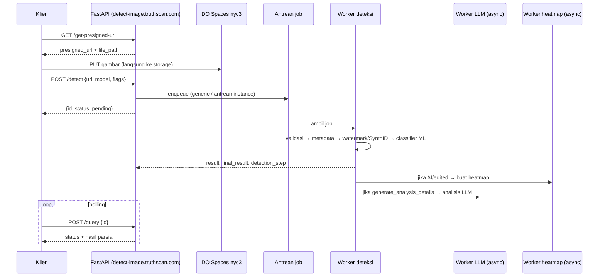

# Cara TruthScan Mendeteksi Gambar Hasil AI — Bedah Teknis Hingga Level Internal

*Versi 2 — riset mendalam, Oktober 2026.*
*Disusun dari spesifikasi OpenAPI publik server deteksi, dokumen `/help` internal, dokumentasi API dan SDK resmi, paket PyPI, halaman tim, serta pengujian independen (IDScan.net, NewsGuard, studi arXiv).*

---

## Daftar Isi

0. [Ringkasan Eksekutif](#0-ringkasan-eksekutif)
1. [Metodologi Riset dan Batasannya](#1-metodologi-riset-dan-batasannya)
2. [Siapa di Balik TruthScan: Korporasi, Tim, dan Konflik Kepentingan](#2-siapa-di-balik-truthscan)
3. [Arsitektur Sistem (Infrastruktur)](#3-arsitektur-sistem-infrastruktur)
4. [Pipeline Deteksi Tahap demi Tahap](#4-pipeline-deteksi-tahap-demi-tahap)
5. [Rekonstruksi Logika Keputusan](#5-rekonstruksi-logika-keputusan)
6. [Di Dalam Model ML: Yang Diketahui vs. Dugaan](#6-di-dalam-model-ml)
7. [Dasar Ilmiah Deteksi Gambar AI](#7-dasar-ilmiah-deteksi-gambar-ai)
8. [Validasi Empiris: Seberapa Benar Klaimnya?](#8-validasi-empiris)
9. [Analisis Mode Kegagalan](#9-analisis-mode-kegagalan)
10. [Vonis: Seberapa Bisa Dipercaya?](#10-vonis)
11. [Protokol Uji Mandiri (untuk Riset)](#11-protokol-uji-mandiri)
12. [Tabel Fakta vs. Inferensi](#12-tabel-fakta-vs-inferensi)
13. [Sumber](#13-sumber)

---

## 0. Ringkasan Eksekutif

TruthScan tidak bekerja dengan satu "otak AI" tunggal. Ia adalah **sistem ensembel bertingkat** yang terdiri atas:

| # | Komponen | Sifat | Status bukti |
|---|---|---|---|
| 0 | Validasi file + heuristik kualitas (ukuran, blur/gelap, rekam layar) | Deterministik/heuristik | Terdokumentasi |
| 1 | Pembacaan metadata (ExifTool + Pillow) | Berbasis aturan | Terdokumentasi |
| 2 | Detektor watermark generator (field historis `ocr`) | Model klasifikasi watermark | Terdokumentasi |
| 2b | Pemeriksaan **SynthID** (field `synthid`) | Belum didokumentasikan publik | **Ditemukan di skema OpenAPI** |
| 3 | Classifier gambar ML (`ml_model`) — inti sistem | Deep learning | Terdokumentasi (arsitektur tidak) |
| 4 | Heatmap activation map (JET + alpha + normalisasi) | Explainability | Terdokumentasi |
| 5 | **Analisis naratif oleh LLM** sebagai job asinkron sekunder | Large language model (multimodal) | **Dikonfirmasi oleh dokumen `/help`** |
| 6 | Moderasi konten opsional | Terpisah dari deteksi AI | Ditemukan di skema |

Temuan kunci yang tidak terlihat di halaman pemasaran:

1. **Backend TruthScan dan Undetectable.ai adalah satu sistem yang sama.** SDK Python resmi TruthScan memakai default `base_url = https://ai-image-detect.undetectable.ai`, dan dokumen `/help` di server TruthScan masih berjudul dan berisi instruksi Undetectable.AI.
2. **Ada field `synthid` tersembunyi** dalam skema respons, menandakan adanya tahap pengecekan watermark SynthID (Google) yang tidak disebut di dokumentasi publik.
3. **Tahap watermark bisa memutus pipeline lebih awal** dan mengeluarkan *nama generator* (mis. "Grok") sebagai `final_result` pada `detection_step = 2`, tanpa menjalankan classifier ML.
4. **Penjelasan "kenapa gambar ini AI" ditulis oleh LLM terpisah**, bukan dibaca langsung dari classifier. Ini menjelaskan mengapa alasan yang diberikan kadang tidak masuk akal (mis. menandai tanda tangan di SIM sebagai bukti AI).
5. **Klaim 99%+ tidak tervalidasi secara independen.** Uji pihak luar pada domain spesifik menunjukkan angka jauh lebih rendah (71% deteksi, 57% false positive pada foto KTP/SIM asli), sementara uji yang memuji TruthScan sebagian besar berasal dari pihak terafiliasi atau berbayar.

---

## 1. Metodologi Riset dan Batasannya

**Sumber primer yang diperiksa langsung:**
- `https://detect-image.truthscan.com/openapi.json` — spesifikasi OpenAPI 3.1 yang otomatis dihasilkan FastAPI. Ini sumber paling "internal" yang tersedia publik, karena mencerminkan skema data aktual di kode server, termasuk field yang tidak didokumentasikan.
- `https://detect-image.truthscan.com/help` — dokumen panduan performa yang disajikan server, berisi detail latensi tiap tahap.
- Dokumentasi API, dokumentasi SDK (Python, JS/TS, PHP, .NET, Java), dan halaman paket PyPI.
- Halaman tim, halaman produk, dan whitepaper TruthScan.

**Sumber sekunder:** uji IDScan.net (April 2026), audit NewsGuard (Mei 2026), studi benchmark arXiv 2602.07814 (Februari 2026), ulasan Unite.AI, DIY AI, dan artikel Undetectable.ai.

**Batasan yang harus disadari:**
- Bobot model, arsitektur jaringan, dataset latih, dan ambang keputusan **tidak dipublikasikan**. Repositori GitHub SDK yang dirujuk PyPI (`truthscan/image-detection-sdk`) mengembalikan 404, kemungkinan privat.
- TruthScan **tidak memiliki paper ilmiah, paten publik, atau whitepaper teknis tentang model deteksinya**. Empat whitepaper yang ada bertema tren fraud (asuransi, kesehatan, keuangan, identitas), bukan metodologi.
- Bagian yang ditandai **[INFERENSI]** adalah rekonstruksi berdasarkan bukti tidak langsung dan praktik umum industri, bukan klaim resmi.

---

## 2. Siapa di Balik TruthScan

### 2.1 Entitas hukum

Hak cipta situs TruthScan tercatat atas nama **Undetectable Inc. dba TruthScan**, beralamat di Sheridan, Wyoming. Undetectable Inc. adalah perusahaan yang sama yang menjalankan **Undetectable.ai**, produk yang terkenal sebagai *AI humanizer*, yaitu alat yang mengubah teks AI agar lolos dari detektor AI.

### 2.2 Bukti backend bersama

| Bukti | Lokasi |
|---|---|
| SDK Python TruthScan memakai default `base_url="https://ai-image-detect.undetectable.ai"` | README paket PyPI `truthscan-image-detector-client` |
| Endpoint `/help` di server TruthScan berisi dokumentasi berjudul Undetectable.AI, dengan URL `ai-image-detect.undetectable.ai` | `detect-image.truthscan.com/help` |
| Endpoint internal pemakaian menyebut koleksi data `ud_documents` ("ud" = Undetectable) | Skema OpenAPI, endpoint `/organizations/{org_id}/usage` |
| Bucket penyimpanan `ai-image-detector-prod` dan `-dev` dipakai keduanya | Dokumentasi API |

**Implikasi:** Detektor gambar di TruthScan, Undetectable.ai, imagedetector.com (diakuisisi 2025), serta mesin gambar ZeroGPT dan DeepAI (lewat kemitraan) kemungkinan besar berbagi model atau keluarga model yang sama. Mungkin ada perbedaan tier, karena TruthScan menyebut adanya "custom enterprise models".

### 2.3 Profil tim teknis

Dari halaman tim resmi, peran teknis yang tercantum hanya dua:
- **Technical Lead** — insinyur perangkat lunak berpengalaman 20+ tahun yang memimpin arsitektur platform deteksi.
- **Data Science Lead** — keahliannya dideskripsikan sebagai optimasi dan deployment model AI/ML ke perangkat keras, khususnya **kuantisasi** dan **akselerasi hardware** jaringan saraf.

Tidak ada peneliti computer vision atau forensik citra yang tercantum, tidak ada publikasi akademik, dan tidak ada afiliasi universitas. Jajaran pimpinan lainnya berlatar bisnis, pemasaran, keuangan, dan (untuk COO) pencegahan fraud di Departemen Luar Negeri AS.

**[INFERENSI]** Fokus keahlian pada kuantisasi dan akselerasi menjelaskan klaim latensi <500 ms. Model kemungkinan dikompresi (INT8/FP16) dan dijalankan dengan runtime teroptimasi. Ketiadaan peneliti forensik yang terlihat publik juga mengisyaratkan pendekatan yang lebih **data-driven** (melatih classifier pada data besar) ketimbang berbasis fitur forensik buatan tangan.

### 2.4 Konflik kepentingan yang perlu dicatat

- Perusahaan induk menjual alat untuk **lolos** dari detektor (teks) sekaligus alat **pendeteksi**. IDScan.net menyorot hal ini secara eksplisit.
- "Benchmark independen" yang menyatakan TruthScan satu-satunya detektor dengan skor ≥97% di semua kategori dilakukan oleh **tim riset Undetectable.ai**, yaitu perusahaan yang sama.
- Ulasan Unite.AI mencantumkan pengungkapan bahwa mereka dapat menerima kompensasi, dan hasilnya kemudian disebarkan TruthScan lewat siaran pers PRNewswire.

---

## 3. Arsitektur Sistem (Infrastruktur)

### 3.1 Stack yang teridentifikasi

| Komponen | Temuan | Sumber |
|---|---|---|
| Framework API | **FastAPI** (Python), OpenAPI 3.1, versi API `0.1.0` | `openapi.json` |
| Penyimpanan objek | **DigitalOcean Spaces** region `nyc3` (kompatibel S3), bucket `ai-image-detector-prod` / `-dev` | Dokumentasi API, `/help` |
| Upload | Presigned URL ala S3 (`x-amz-acl: private`), PUT langsung ke storage | Dokumentasi API |
| Eksekusi | **Asinkron berbasis antrean**: `/detect` → `pending` → `analyzing` → `done` | Dokumentasi API |
| Routing model | Parameter `model` = `generic` atau `instance_id/model` → dikirim ke **antrean khusus** per instance enterprise | Skema OpenAPI |
| Billing | Endpoint internal sinkronisasi pemakaian ke **Stripe** (metered billing), dilindungi header `x-job-secret` | Skema OpenAPI, `/help` |
| Proxy | `proxy_host` yang di-allowlist (`mcp-cdn.truthscan.com`) untuk klien dengan kebijakan jaringan ketat (mis. integrasi MCP) | `/help` |
| Tipe dokumen | Enum `Image`, `SampleImage`, `image-zip` | Skema OpenAPI |
| SDK | Python, JS/TS, PHP, .NET, Java; versi berformat tanggal (`20260709.0.0`), polling default 0,5 detik × 60 percobaan | PyPI |

### 3.2 Alur data end-to-end



### 3.3 Catatan keamanan

Dokumentasi resmi menyatakan bahwa `/query` **tidak memerlukan API key**: siapa pun yang mengetahui UUID dokumen bisa membaca skornya. UUIDv4 sulit ditebak, tetapi untuk data sensitif (mis. foto identitas) ID dokumen harus diperlakukan seperti rahasia. Aset heatmap dan preview dapat diamankan dengan opsi "secure URLs".

---

## 4. Pipeline Deteksi Tahap demi Tahap

### Tahap 0 — Validasi dan Heuristik Kualitas Input

- **Validasi format dan ukuran:** 1 KB–10 MB; JPG, PNG, WebP, JFIF, HEIC, HEIF, AVIF, BMP, TIFF, GIF, SVG (dikonversi ke PNG), PDF (hanya gambar pertama). Hasilnya di field `is_valid`.
- **`warnings` (tidak memengaruhi skor, hanya peringatan):**

| `type` | Pemicu | Arti |
|---|---|---|
| `source_size` | File < **50 KB**, atau sisi terpanjang < **150 px** | Gambar terlalu kecil, sehingga deteksi bisa menyimpang |
| `blur_dark` | Heuristik ketajaman/kecerahan; label `Blurred` atau `Dark` | Sinyal forensik melemah |
| `screen_recapture` | Heuristik foto layar; `metrics.is_screen` + confidence | Foto/tangkapan layar menghapus jejak asli |
| `watermark` | Watermark generator terdeteksi dengan confidence tinggi (skala 0–1) | Ringkasan dari tahap 2 |

Ambang 50 KB dan 150 px menunjukkan bahwa tim TruthScan menyadari **classifier mereka tidak andal pada gambar kecil**. Ini konsisten dengan pernyataan pendiri ScamAI kepada NewsGuard bahwa detektor umumnya memerlukan resolusi tinggi.

### Tahap 1 — Metadata

- Diekstrak memakai **ExifTool** dan **Pillow**.
- Skema `metadata` adalah **tuple 2 elemen `[verdict, alasan]`**. Contoh dari dokumentasi:
  - `["No Information Detected for Real/AI", "Could not find anything from ExifTool and Pillow metadata"]`
  - `["Not AI Generated", "No AI indicators found"]`
- `metadata_basic_source`: ringkasan asal, bisa model kamera ponsel, tool AI, atau software editing.
- Yang lazim diperiksa: tag `Software`/`CreatorTool`, `Make`/`Model` kamera, blok XMP/IPTC dari generator, dan manifest **C2PA** (yang kini disematkan Google pada gambar Nano Banana Pro).

**Sifat:** cepat dan deterministik. Bila metadata secara eksplisit menyebut generator, ini bukti kuat. Namun metadata **sangat rapuh**: hilang saat screenshot, kompresi media sosial, atau ekspor ulang. Pengujian IDScan menunjukkan bahwa **ketiadaan metadata** ikut dipakai sebagai alasan mencurigai foto asli. Ini praktik yang bermasalah (dibahas di §9).

### Tahap 2 — Detektor Watermark (field `ocr`)

- Nama `ocr` adalah warisan historis. Awalnya kemungkinan membaca teks/logo watermark yang terlihat. Kini dokumentasi menyebutnya **pipeline deteksi watermark**.
- Format `[label, skor 0–100]`. Label adalah kelas watermark (mis. `"Gemini"`, `"Grok"`) atau `"OCR did not detect AI"`.
- Ketika yakin, hasilnya juga diringkas di `warnings` (`type: watermark`). Ketika ragu, hasil hanya tercatat di `ocr`.

**Temuan penting: tahap ini bisa memutus pipeline.** Contoh respons resmi di skema OpenAPI:

```json
{
  "result": 0,
  "status": "analyzing",
  "result_details": {
    "detection_step": 2,
    "final_result": "Grok",
    "confidence": 95.0,
    "metadata": ["Not AI Generated", "No AI indicators found"],
    "ocr": ["Grok", 95],
    "warnings": [{"label": "Blurred", "type": "blur_dark"}]
  }
}
```

Pada kasus ini, metadata menyatakan "tidak ada indikasi AI", tetapi detektor watermark mengenali watermark Grok dengan skor 95. Pipeline lalu **berhenti di tahap 2**: `final_result` diisi **nama generator**, bukan label empat kelas, dan `result` (skor ML) bernilai 0 karena classifier tidak dijalankan.

### Tahap 2b — SynthID (field tersembunyi `synthid`)

Skema `ResultDetails` di OpenAPI memuat field **`synthid`** dengan format sama seperti `ocr` dan `ml_model`: `[label, skor]`. Field ini **tidak disebut sama sekali** di dokumentasi publik.

Konteks: **SynthID** adalah watermark tak kasatmata milik Google DeepMind yang disematkan di konten AI Google. Google menyebut lebih dari 20 miliar konten telah diberi watermark ini sejak 2023, dan verifikasinya tersedia lewat aplikasi Gemini serta portal SynthID Detector. Watermark ini dapat terdeteksi sebagian pada gambar yang hanya diedit sebagian oleh AI Google, tetapi tidak berlaku untuk generator non-Google.

**[INFERENSI]** Ada tiga kemungkinan implementasi:
1. TruthScan memiliki akses ke API/portal verifikasi SynthID (Google menyatakan sedang bermitra dengan pihak ketiga).
2. TruthScan melatih classifier sendiri untuk mengenali **pola statistik** SynthID (tanpa kunci resmi). Pendekatan ini lebih lemah dan berisiko false positive.
3. Field ini adalah fitur eksperimental yang belum aktif untuk semua pengguna.

Karena tidak didokumentasikan, hasil field `synthid` sebaiknya tidak dijadikan dasar keputusan sebelum ada klarifikasi dari vendor.

### Tahap 3 — Classifier ML (`ml_model`)

Ini inti sistem dan satu-satunya komponen yang bekerja tanpa watermark atau metadata.
- Output `[label, probabilitas]`, mis. `["AI Generated", 90.24]`.
- Label empat kelas: **AI Generated**, **AI Edited**, **Digitally Edited**, **Real**.
- Ada model `generic` untuk umum dan model per-instance enterprise.
- Detail internal dibahas di §6.

### Tahap 4 — Fusi Keputusan

Output akhir: `result`, `confidence`, `final_result`, `final_label_confidence`.
- `final_label_confidence` dibaca sebagai "gambar ini N% [label]". Contoh: "Real" dengan 80 berarti 80% yakin asli.
- `result` adalah skor utama. Pada pipeline penuh nilainya sama dengan skor `ml_model`, sedangkan pada pemutusan di tahap 2 nilainya bisa 0.
- **Bobot fusi tidak dipublikasikan.** Dari contoh-contoh resmi, polanya **hirarkis (short-circuit)**, bukan rata-rata berbobot: bukti watermark yang kuat mengambil alih, dan bila tidak ada, classifier ML yang memutuskan.

### Tahap 5 — Heatmap (Activation Map)

Fakta terdokumentasi:
- Dibuat **asinkron**, hanya untuk prediksi **AI/edited**. Gambar "Real" tidak pernah mendapat heatmap.
- Berupa *activation map* berwarna skema **JET**, dengan **alpha dari model**, dan langkah **normalisasi** yang bisa dimatikan.
- Opsi output: di-overlay ke gambar asli, atau PNG RGBA transparan.
- Latensinya "moderat" menurut `/help`.

**[INFERENSI kuat]** Kombinasi "activation map + normalisasi + hanya untuk kelas positif + JET" adalah ciri khas **Grad-CAM** atau varian CAM:

1. Hitung gradien skor kelas "AI" terhadap feature map lapisan konvolusi/attention terakhir.
2. Rata-ratakan gradien secara spasial untuk mendapatkan bobot tiap kanal.
3. Jumlahkan feature map berbobot, lalu terapkan ReLU.
4. Normalisasi min-max ke [0, 1] (bagian yang bisa dimatikan oleh `generate_heatmap_normalized=false`).
5. Upsample ke resolusi gambar, warnai dengan JET, dan gunakan nilai aktivasi sebagai alpha.

Konsekuensi penting: Grad-CAM menunjukkan **area yang paling memengaruhi skor model**, bukan "area yang dipalsukan" dalam arti forensik. Area merah bisa saja wajah asli yang kebetulan bertekstur halus.

### Tahap 6 — Analisis Naratif oleh LLM

Dokumen `/help` server menyatakannya dengan jelas: fitur `generate_analysis_details` **menjalankan LLM sebagai job asinkron sekunder**, dan ini fitur dengan **dampak latensi tertinggi**.

Output-nya: `imageTags` (≤5), `agreement` (`strong`/`moderate`/`weak`/`disagreement`), `confidence`, `keyIndicators`, `detailedReasoning`, `visualPatterns`, `recommendations`.

**[INFERENSI]** Alur kerja yang paling masuk akal:
1. LLM multimodal (vision-language model) menerima gambar plus hasil detektor (label dan skor).
2. LLM diminta menjelaskan bukti visual dan menilai sendiri.
3. `agreement` mengukur **kesesuaian antara penilaian LLM dan classifier**.

Dokumentasi menyebut `detailedReasoning` sebagai penjelasan yang **terkait dengan hasil detektor**. Artinya LLM kemungkinan besar diberi tahu verdict classifier sebelum menulis alasan, sehingga penjelasannya cenderung **merasionalisasi** verdict yang sudah ada (lihat §9.2).

### Tahap 7 — Moderasi Konten (opsional)

Field `include_content_moderation`, `content_moderation`, dan `content_moderation_status` ada di skema. Ini produk terpisah ("Image Content Moderation") yang dapat ditumpangkan ke job deteksi yang sama, dan tidak memengaruhi verdict AI.

---

## 5. Rekonstruksi Logika Keputusan

**[INFERENSI]** Pseudo-code berikut merekonstruksi alur berdasarkan field `detection_step`, contoh respons resmi, dan deskripsi `/help`. Ini **bukan kode asli TruthScan**.

```python
def detect(image, flags, model="generic"):
    if not validate(image):                      # format, 1KB–10MB
        return {"is_valid": False}

    warnings = []
    warnings += size_checks(image)               # <50KB, <150px  → source_size
    warnings += blur_dark_heuristic(image)       # Blurred / Dark
    warnings += screen_recapture_check(image)    # is_screen

    # --- Tahap 1: metadata ---
    meta = exiftool_and_pillow(image)            # → [verdict, reason]
    if meta.explicitly_names_ai_generator:
        return finalize(step=1, label="AI Generated", source=meta)

    # --- Tahap 2: watermark (+ SynthID?) ---
    wm_label, wm_score = watermark_model(image)  # field 'ocr'
    synth = synthid_check(image)                 # field 'synthid' (tak terdokumentasi)
    if wm_score >= HIGH_THRESHOLD:
        warnings.append({"type": "watermark", "label": wm_label})
        return finalize(step=2, label=wm_label,  # mis. "Grok"
                        confidence=wm_score, result=0)

    # --- Tahap 3: classifier ML ---
    clf = load_model(route=model)                # generic / instance_id/model
    label, prob = clf.predict(preprocess(image)) # 4 kelas
    out = finalize(step=3, label=label, confidence=prob, result=prob)

    # --- Pekerjaan asinkron ---
    if label in {"AI Generated", "AI Edited", "Digitally Edited"} and flags.heatmap:
        enqueue(gradcam_like_heatmap, clf, image)        # JET + alpha
    if flags.analysis_details:
        enqueue(llm_explain, image, verdict=(label, prob)) # agreement, reasoning
    if flags.preview:
        enqueue(make_preview, image)
    return out
```

---

## 6. Di Dalam Model ML

### 6.1 Yang diketahui pasti

- Dilatih pada data berskala besar. Klaim vendor: "jutaan titik data", 50 juta+ gambar dianalisis, dan evaluasi internal pada 92 generator serta 250.000 gambar asli.
- Mengklaim mengenali ratusan generator, termasuk GPT Image 1.5, Nano Banana/Pro, Midjourney V7, DALL·E 3, SD 3.5, FLUX.2, Grok Imagine, Ideogram, Recraft, Firefly, StyleGAN.
- Model diperbarui berkala ("continuous learning").
- Tersedia varian model kustom enterprise yang diklaim lebih cepat dan akurat.
- Output empat kelas, dengan heatmap berbasis aktivasi, sehingga model pasti berupa jaringan saraf yang aktivasinya dapat diakses.

### 6.2 [INFERENSI] Kemungkinan arsitektur

| Pertanyaan | Dugaan terbaik | Alasan |
|---|---|---|
| Backbone | CNN (EfficientNet/ConvNeXt) atau ViT, kemungkinan di atas fitur foundation model (CLIP/DINOv2) | Praktik industri 2025–2026; CAM paling alami pada CNN atau ViT dengan feature map spasial; foundation model terbukti lebih baik menggeneralisasi ke generator baru |
| Kepala klasifikasi | Softmax 4 kelas, atau multi-head (AI vs. real + edit vs. tidak) | Label AI Edited dan Digitally Edited butuh pemisahan "jenis edit" |
| Deployment | Model terkuantisasi (INT8/FP16) dengan runtime teroptimasi (mis. TensorRT/ONNX Runtime) | Keahlian Data Science Lead + klaim <500 ms |
| Input | Crop/resize ke resolusi tetap, kemungkinan multi-crop | Peringatan `source_size` menunjukkan sensitivitas resolusi |
| Atribusi generator | Kemungkinan oleh detektor watermark, bukan classifier utama | Nama generator hanya muncul di field `ocr`/`final_result` saat short-circuit |

### 6.3 Risiko "jalan pintas" (shortcut learning)

Masalah klasik detektor gambar AI adalah model belajar **ciri yang tidak relevan** yang kebetulan berkorelasi dengan label dalam data latih:
- **Format/kompresi:** gambar AI sering PNG tanpa kompresi, sedangkan foto asli umumnya JPEG. Detektor terbuka di Hugging Face secara eksplisit mendokumentasikan bahwa tanpa normalisasi format, model bisa mencapai akurasi 99% hanya dengan belajar "PNG = palsu".
- **Ketiadaan EXIF**, resolusi khas generator (1024×1024), atau gaya fotografi "terlalu rapi".

Tidak ada informasi publik tentang bagaimana TruthScan menangani bias ini. Pola false positive pada foto ponsel berkualitas tinggi dan foto yang diproses ulang (§8, §9) **konsisten dengan** adanya shortcut semacam ini.

---

## 7. Dasar Ilmiah Deteksi Gambar AI

Bagian ini menjelaskan mengapa sinyal-sinyal di atas bekerja secara prinsip. Ini literatur umum, bukan klaim spesifik TruthScan.

### 7.1 Rantai fisik kamera vs. proses generatif

Foto asli melewati lensa → sensor (dengan **PRNU**, noise pola sensor yang unik per perangkat) → **demosaicing** filter Bayer → pemrosesan ISP (denoise, sharpening, tone mapping) → kompresi JPEG. Setiap tahap meninggalkan korelasi statistik antar-piksel yang khas. Gambar AI tidak melewati rantai ini, sehingga korelasi tersebut absen atau hanya "ditiru".

### 7.2 Artefak domain frekuensi

- Dekoder VAE pada model difusi laten (Stable Diffusion, FLUX) dan generator GAN memakai operasi **upsampling**. Operasi ini menghasilkan pola periodik yang tampak sebagai puncak atau grid pada spektrum **FFT/DCT**.
- Distribusi energi frekuensi tinggi pada gambar difusi cenderung berbeda dari foto kamera.
- Pola ini cukup khas per arsitektur, sehingga memungkinkan "sidik jari" generator.

### 7.3 Residual noise

Residual (gambar dikurangi versi yang di-denoise) pada foto asli mencerminkan sensor dan ISP, sedangkan pada gambar difusi cenderung seragam. Inilah yang dirujuk contoh keluaran TruthScan sebagai pola noise seragam khas model difusi.

### 7.4 Konsistensi semantik dan fisik

Arah bayangan, pantulan, perspektif, teks kecil, dan tekstur kulit adalah bukti yang biasanya ditangkap oleh LLM/VLM pada tahap analisis naratif, bukan oleh classifier statistik.

### 7.5 Mengapa ini semua rapuh

Kompresi JPEG berulang, resize, filter, penambahan grain, dan screenshot **menghancurkan sinyal frekuensi tinggi dan noise**, yaitu sinyal yang justru paling diandalkan detektor. Sebaliknya, pemrosesan berat pada foto asli dapat membuatnya **mirip** gambar sintetis. Kedua arah kesalahan ini terlihat dalam data empiris di bawah.

---

## 8. Validasi Empiris

### 8.1 Klaim vendor

- Akurasi 99%+, rata-rata 99,3% pada 92 generator dan 250.000 gambar asli, dengan false positive rate (FPR) < 1%.
- Latensi < 500 ms (enterprise).
- Metodologi, dataset uji, dan definisi "akurasi" **tidak dipublikasikan**. Klaim "99%" bisa berarti akurasi rata-rata pada data yang mirip data latih, yang sangat berbeda dari performa pada data liar.

### 8.2 Pengujian pihak ketiga

| Penguji | Independensi | Setup | Hasil |
|---|---|---|---|
| **Tim riset Undetectable.ai** | ❌ Perusahaan sama | 10 gambar (ChatGPT, Nano Banana, Midjourney) | Satu-satunya detektor ≥97% |
| **Unite.AI** (Feb 2026) | ⚠️ Ada pengungkapan kompensasi | Uji manual beberapa gambar | Headshot AI 97% palsu, foto asli 2% AI, akurasi 96–99% |
| **Gold Penguin** | ? (dikutip vendor) | Gambar Midjourney | 97,5% terdeteksi |
| **IDScan.net** (Apr 2026) | ⚠️ Pesaing di verifikasi ID | Foto ID: AI, asli (iPhone 16 Pro), palsu fisik | **71%** ID AI terdeteksi; **57%** ID asli salah ditandai AI (skor 53–94%); ID palsu fisik 67% dilabeli "Real but Digitally Edited" |
| **NewsGuard** (Mei 2026) | ✅ Independen | 45 gambar perang Iran: 15 asli, 15 edit ringan, 15 edit berat; ambang 50% | Menguji **ZeroGPT**, yang detektor gambarnya **memakai teknologi TruthScan**: 20% foto asli salah ditandai AI; 80% edit ringan ditandai AI; **93,3%** edit berat terdeteksi |

**Catatan NewsGuard:** TruthScan tidak diuji langsung. ZeroGPT diuji memakai tier gratis/termurah, dan model yang dipakai ZeroGPT belum tentu identik dengan model enterprise TruthScan. Meski demikian, ini satu-satunya audit independen yang menyentuh teknologi TruthScan.

### 8.3 Konteks: kondisi bidang deteksi secara umum

- **Studi arXiv 2602.07814** (Ren dkk., Feb 2026) menguji 16 metode deteksi open-source (23 varian) pada 2,6 juta gambar dari 291 generator:
  - Tidak ada detektor yang unggul di semua dataset.
  - Akurasi rata-rata berkisar **37,5–75%**.
  - Generator komersial modern (Flux Dev, Firefly v4, Midjourney v7) menjatuhkan akurasi rata-rata ke **18–30%**.
  - Keselarasan data latih menyebabkan variasi performa 20–60% dalam keluarga arsitektur yang sama.
  - *Catatan: studi ini menguji model open-source, bukan TruthScan.*
- **Kemampuan manusia:** studi Microsoft 2025 (12.500 peserta) menemukan manusia benar hanya 62%. Studi CACM 2025 (1.276 peserta) mencatat 51,2%, setara lempar koin.
- **NewsGuard** menemukan lima detektor terkemuka **tidak sepakat** pada 35 dari 45 gambar, karena tidak ada standar industri tentang seberapa besar edit dianggap "AI".

### 8.4 Interpretasi

1. **Pada gambar AI "bersih"** dari generator populer (resolusi penuh, belum diproses), TruthScan tampaknya bekerja baik. Ini konsisten di berbagai laporan.
2. **Pada data dunia nyata**, yaitu foto ponsel dokumen, gambar yang dikompresi, difilter, atau diedit ringan, performa turun tajam dan **FPR jauh di atas klaim <1%**.
3. **Edit ringan (enhancement AI) diperlakukan agresif.** Menurut data NewsGuard via ZeroGPT, 80% edit pencahayaan ringan ditandai AI. Ini bisa dianggap benar secara teknis (memang ada jejak AI), tetapi menyesatkan bila pengguna membaca label itu sebagai "gambar ini palsu".
4. Celah antara klaim 99% dan hasil uji independen **sejalan dengan pola umum di bidang ini**: akurasi laboratorium tidak tergeneralisasi ke data liar.

---

## 9. Analisis Mode Kegagalan

### 9.1 Pemetaan alasan false positive ke tahap pipeline

Alasan-alasan yang dicatat IDScan saat TruthScan salah menandai SIM asli dapat dipetakan ke komponen sistem:

| Alasan yang diberikan TruthScan | Kemungkinan sumber | Diagnosis |
|---|---|---|
| Kurangnya metadata asli | Tahap 1 + LLM | Ketiadaan metadata diperlakukan sebagai bukti, padahal semua foto uji memiliki metadata serupa |
| Adanya tanda tangan tulisan tangan di SIM | **LLM (tahap 6)** | Halusinasi/rasionalisasi; tanda tangan adalah fitur standar SIM |
| Presentasi kartu yang terlalu sempurna di atas karpet | **LLM (tahap 6)** | Rasionalisasi post-hoc dari verdict classifier |
| Kualitas gambar terlalu tinggi | Classifier (tahap 3) + LLM | Kemungkinan shortcut learning: "terlalu bersih = AI" |
| Watermark DMV dicurigai | Detektor watermark / LLM | Watermark keamanan dokumen disalahartikan |

### 9.2 Masalah "faithfulness" penjelasan

Ini temuan paling penting dari bedah internal ini. **Verdict diputuskan oleh classifier, tetapi penjelasannya ditulis oleh LLM terpisah yang diberi tahu verdict tersebut.** Akibatnya:
- Penjelasan bisa terdengar meyakinkan tetapi **bukan alasan sebenarnya** mengapa classifier memberi skor itu. Fenomena ini dikenal sebagai *unfaithful explanation*.
- LLM cenderung mencari pembenaran untuk verdict yang sudah ada (*confirmation bias* buatan), sehingga muncul alasan absurd seperti tanda tangan atau karpet bersih.
- Field `agreement` adalah satu-satunya indikator bila LLM tidak setuju. Nilai `weak` atau `disagreement` harus dianggap sinyal serius.

**Konsekuensi praktis:** jangan pernah mengutip `detailedReasoning` atau `keyIndicators` sebagai "bukti forensik" dalam laporan, sengketa, atau keputusan akademik. Yang paling dekat dengan bukti adalah `ml_model`, `ocr`/`synthid`, `metadata`, dan heatmap. Heatmap pun hanya menunjukkan atensi model, bukan lokasi manipulasi.

### 9.3 Mode kegagalan lain

| Mode | Mekanisme | Arah kesalahan |
|---|---|---|
| Screenshot/foto layar | Menghapus metadata dan sinyal frekuensi, menambah pola moiré | FP dan FN |
| Kompresi media sosial | Merusak residual noise | FN (AI lolos) dan FP (asli dicurigai) |
| Gambar kecil (<150 px, <50 KB) | Informasi tidak cukup | Acak; diakui lewat `source_size` |
| Edit AI ringan pada foto asli | Ambang sensitif | Foto asli dilabeli "AI Edited"/AI |
| Generator baru | Belum ada di data latih | FN sampai model diperbarui |
| Foto ponsel modern berkualitas tinggi | Pemrosesan komputasional ponsel (HDR, smoothing, AI enhancement bawaan) mirip artefak AI | FP |
| Watermark dipotong (crop) | Tahap 2 gagal, bergantung pada tahap 3 | FN |
| Dokumen (ID, struk) | Permukaan datar, pencahayaan rata, teks rapi | FP tinggi (data IDScan) |

Catatan untuk foto ponsel: ponsel modern sudah menjalankan model AI di ISP-nya (night mode, denoising neural, portrait blur). Garis antara "foto asli" dan "AI edited" secara teknis memang kabur, dan detektor mana pun akan kesulitan di sini.

---

## 10. Vonis

**Apakah TruthScan benar-benar bisa mendeteksi gambar AI?** Ya, dengan syarat ketat.

**Kuat pada:**
- Gambar AI utuh dari generator populer, resolusi penuh, dan belum diproses ulang.
- Gambar yang masih membawa watermark (Gemini, Grok) atau metadata generator. Tahap 2 bersifat hampir deterministik di sini.
- Penyaringan volume besar dengan latensi rendah sebagai filter awal.

**Lemah pada:**
- Foto dokumen dan foto ponsel asli berkualitas tinggi, dengan FPR jauh di atas klaim.
- Gambar terkompresi, di-screenshot, atau kecil.
- Membedakan edit ringan dari pemalsuan bermakna.
- **Penjelasan** yang diberikan tidak dapat diandalkan sebagai bukti, karena ditulis LLM secara post-hoc.

**Transparansi rendah:**
- Tidak ada paper, model card, atau metodologi benchmark.
- Ada field tak terdokumentasi (`synthid`) dan perilaku short-circuit yang tidak dijelaskan.
- Bukti "independen" yang memuji berasal dari perusahaan yang sama atau ulasan berbayar.
- Perusahaan induk juga menjual alat penghindar deteksi (untuk teks).

**Kesimpulan:** klaim "99%+" sebaiknya dibaca sebagai **performa pada data uji internal yang tidak diungkap**, bukan performa yang bisa diharapkan pada data sendiri. TruthScan layak dipakai sebagai **filter penyaring berlapis** dengan tinjauan manusia, tetapi **tidak layak** sebagai pengambil keputusan tunggal, apalagi sebagai bukti dalam sengketa akademik atau hukum.

---

## 11. Protokol Uji Mandiri

Untuk konteks penelitian, misalnya memvalidasi gambar dokumentasi lab atau foto produk pangan, jangan percaya angka vendor; ukur sendiri.

### 11.1 Desain dataset

| Strata | Isi | Tujuan |
|---|---|---|
| R0 | Foto asli dari kamera/ponsel yang dipakai di lab, file original | Baseline FPR |
| R1 | R0 yang dikompresi via WhatsApp/Instagram | FPR setelah transmisi |
| R2 | R0 yang di-screenshot | FPR rekam layar |
| R3 | R0 dengan edit non-AI (crop, brightness via Lightroom/Canva) | Uji label "Digitally Edited" |
| R4 | R0 dengan edit AI ringan (enhance, hapus objek) | Uji ambang "AI Edited" |
| A0 | Gambar AI dari 4–6 generator (ChatGPT, Gemini, Midjourney, FLUX, Grok), original | TPR baseline |
| A1 | A0 dengan watermark di-crop + metadata dihapus | Memaksa pipeline ke tahap 3 |
| A2 | A1 + kompresi dan resize | TPR kondisi liar |

Target minimal 50–100 gambar per strata agar interval kepercayaan bermakna.

### 11.2 Metrik

- **TPR** (sensitivitas) dan **FPR**, per strata. Jangan hanya akurasi total.
- **AUROC** memakai skor kontinu `result`.
- **Kalibrasi:** apakah skor 80 benar-benar berarti sekitar 80% kasus AI? Gunakan reliability diagram atau Brier score.
- Distribusi `detection_step`: berapa persen keputusan diambil dari metadata/watermark vs. ML.
- Distribusi `agreement` dan korelasinya dengan kesalahan.
- Interval kepercayaan 95% (Wilson) untuk setiap proporsi.

### 11.3 Skrip evaluasi minimal (Python, memakai SDK resmi)

```python
import os, csv, glob
from truthscan.image_detection import ImageDetectionClient

client = ImageDetectionClient(api_key=os.environ["TRUTHSCAN_API_KEY"])

rows = []
for path in glob.glob("dataset/*/*.*"):           # dataset/<strata>/<file>
    strata = path.split(os.sep)[-2]
    truth = "AI" if strata.startswith("A") else "Real"
    r = client.detect(path)
    d = r.get("result_details") or {}
    rows.append({
        "file": path, "strata": strata, "truth": truth,
        "score": r.get("result"),
        "final_result": d.get("final_result"),
        "final_label_confidence": d.get("final_label_confidence"),
        "detection_step": d.get("detection_step"),
        "metadata": d.get("metadata"),
        "ocr": d.get("ocr"),
        "synthid": d.get("synthid"),
        "ml_model": d.get("ml_model"),
        "warnings": [w.get("type") for w in (d.get("warnings") or [])],
    })

with open("hasil_truthscan.csv", "w", newline="") as f:
    w = csv.DictWriter(f, fieldnames=rows[0].keys())
    w.writeheader(); w.writerows(rows)
```

Catatan: setiap deteksi memakai kredit. Tier gratis hanya 25 hasil/bulan, jadi uji skala penuh memerlukan paket berbayar atau permintaan akses riset ke vendor.

### 11.4 Praktik baik saat memakai hasil

- Simpan **JSON lengkap**, bukan hanya skor.
- Eskalasi ke peninjauan manual bila: skor 40–60, `agreement` = `weak`/`disagreement`, ada warning `blur_dark`/`screen_recapture`/`source_size`, atau `detection_step` = 3 tanpa bukti metadata/watermark.
- Lengkapi dengan **verifikasi C2PA**, **SynthID** resmi via Gemini (untuk gambar Google), dan **pencarian gambar terbalik**.
- Untuk keputusan berisiko tinggi, gunakan **minimal dua detektor dengan metode berbeda**, sambil sadar bahwa banyak detektor "berbeda" sebenarnya memakai mesin yang sama (ZeroGPT, Undetectable.ai, imagedetector.com, DeepAI → TruthScan).

---

## 12. Tabel Fakta vs. Inferensi

| Aspek | Status | Sumber/dasar |
|---|---|---|
| Pipeline bertahap: metadata → watermark → ML (`detection_step` 1–3) | **Fakta** | Dokumentasi API |
| Metadata via ExifTool + Pillow, format `[verdict, alasan]` | **Fakta** | Dokumentasi, skema |
| Field `ocr` = detektor watermark, skor 0–100 | **Fakta** | Dokumentasi |
| Tahap 2 bisa short-circuit dan mengeluarkan nama generator | **Fakta** | Contoh respons di skema OpenAPI |
| Field `synthid` ada di skema respons | **Fakta** | Skema OpenAPI |
| Cara kerja tahap SynthID | **Inferensi** | Tidak didokumentasikan |
| Analisis naratif dijalankan oleh LLM, latensi tertinggi | **Fakta** | Dokumen `/help` |
| `agreement` = kesesuaian LLM vs. classifier | **Inferensi kuat** | Nama field + desain |
| Penjelasan LLM merasionalisasi verdict | **Inferensi** dari dokumentasi + bukti IDScan | §9.2 |
| Heatmap = activation map JET + alpha + normalisasi, hanya untuk AI/edited | **Fakta** | Dokumentasi |
| Heatmap memakai Grad-CAM/CAM | **Inferensi kuat** | Ciri teknis |
| Warning `source_size` (<50 KB, <150 px) | **Fakta** | `/help` |
| Stack FastAPI + DO Spaces + antrean async + Stripe | **Fakta** | Skema, dokumentasi |
| Backend sama dengan Undetectable.ai | **Fakta** | SDK default URL, `/help`, nama koleksi `ud_documents` |
| Model dikuantisasi untuk latensi rendah | **Inferensi** | Profil Data Science Lead + klaim <500 ms |
| Backbone CNN/ViT/CLIP | **Inferensi** | Praktik industri |
| Akurasi 99%+ / FPR <1% | **Klaim vendor, tidak tervalidasi independen** | — |
| FPR tinggi pada foto ID asli (57%) | **Data pihak ketiga (pesaing)** | IDScan |
| Teknologi TruthScan (via ZeroGPT): 20% FP foto berita asli | **Data independen, tidak langsung** | NewsGuard |

---

## 13. Sumber

**Primer (TruthScan):**
1. OpenAPI spec server deteksi — https://detect-image.truthscan.com/openapi.json
2. Dokumen `/help` server deteksi — https://detect-image.truthscan.com/help
3. AI Image Detection API Documentation — https://truthscan.com/truthscan-ai-image-detection-api-documentation
4. AI Image Detection Client SDK Documentation — https://truthscan.com/truthscan-ai-image-detection-client-sdk-documentation
5. PyPI `truthscan-image-detector-client` — https://pypi.org/project/truthscan-image-detector-client/
6. Halaman produk AI Image Detector — https://truthscan.com/ai-image-detector
7. Halaman tim — https://truthscan.com/team
8. Whitepapers — https://truthscan.com/blog/category/whitepapers/

**Pengujian dan audit:**
9. IDScan.net — We tested TruthScan on AI-generated and real IDs — https://idscan.net/blog/we-tested-truthscan-on-ai-generated-and-real-id/
10. NewsGuard — Leading AI Image Detection Tools Mislead Online Users (Mei 2026) — https://www.newsguardtech.com/special-reports/leading-ai-image-detection-tools-mislead-online-users-often-declaring-authentic-content-fake
11. Ren dkk. (2026), arXiv:2602.07814 — https://arxiv.org/abs/2602.07814
12. Unite.AI — TruthScan Review — https://www.unite.ai/truthscan-review
13. DIY AI — TruthScan Review 2026 — https://diyai.io/ai-tools/ai-detection/reviews/truthscan-review/
14. Undetectable.ai — How AI Image Detection Works (afiliasi) — https://undetectable.ai/blog/ai-image-detection/
15. IT Security Guru — TruthScan Performs Under Pressure — https://www.itsecurityguru.org/2026/05/04/truthscan-performs-under-pressure/
16. EmailAnalytics — Best AI Image Detectors 2026 (relasi TruthScan dengan ZeroGPT, DeepAI, imagedetector.com) — https://emailanalytics.com/?p=8239

**Konteks SynthID dan C2PA:**
17. Google Blog — AI image verification in the Gemini app — https://blog.google/technology/ai/ai-image-verification-gemini-app/
18. Google Support — Verify Google AI-generated images with SynthID — https://support.google.com/gemini/answer/16722517

**Ilustrasi shortcut learning (detektor terbuka):**
19. Hugging Face Space — AI Image Detector (CLIP ViT-B/16) — https://husseinelsaadi-ai-image-detector.hf.space/
